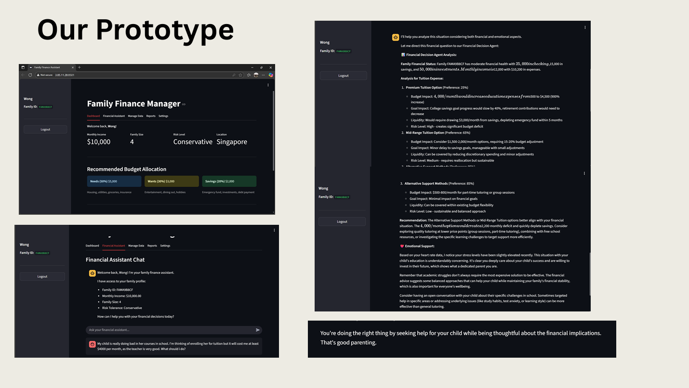

# ClariWealth (Moirai): Family Financial Agent Assistant
Helping families make smarter financial decisions by balancing Al-driven logic with emotional wellbeing data. 

# 📌 Project Overview
> "EMOTIONS CAN HIJACK OUR FINANCIAL DECISIONS IN WAYS LOGIC CAN’T." 
> **Morgan Housel**, *The Psychology of Money*
 
`Problem Statement` - Families often make poor financial decisions under stress, because traditional budgeting tools ignore emotional welbeing and helping visualize both short-term and long-term goals.

ClariWealth was developed for the Simplify Next Agentic AI Hackathon 2025 to address a critical gap in traditional budgeting: the human element. While 60% of Singapore residents face financial stress due to the rising cost of living, most financial tools rely solely on "pure math and logic," ignoring the emotional states that often lead to poor decision-making. 

Our solution is a household multi-agent system that integrates financial data with real-time wellbeing metrics (like heart rate) to provide holistic guidance. 

# 🛠️ System Architecture
The system utilizes an Orchestration Agent that coordinates between specialized agents to provide a balanced response to the user. 

Core Agents:
- Orchestration Agent: Acts as the primary interface, directing queries to the appropriate specialized agents. 
- Household Finance Agent: Analyzes family financial health, including checking/savings balances, investments, and monthly income/expenses. 
- Emotional Agent: Processes physiological data (e.g., heart rate from Fitbit) to detect stress levels and provide empathetic support. 
- Memory Agent: Tracks user spending patterns and past decisions to provide personalized, adaptive recommendations over time. 

Framework: Multi-agent orchestration 
Data Inputs: Family Financial Information (Checking, Savings, Investments) 
Wearable Device Integration (Fitbit Heart Rate Data) 
Historical Spending Patterns 

# ✨ Key Features
- Emotionally Aware Financial Advice: Detects elevated stress levels through wearable data and encourages users to reconsider impulsive spending. 
- Consequence Visualization: Instead of just saying "yes" or "no," the system presents multiple options (Premium vs. Mid-range vs. Alternative) and shows their specific impact on long-term goals like retirement or college savings. 
- Family-Centered Design: Focuses on the collective needs of a household rather than just individual personal finance. 
- Stress Reduction: Lowers decision fatigue by automating complex financial analysis and providing actionable recommendations. 

# 🚀 How It Works: An Example
If a user asks about enrolling a child in expensive tuition ($4,000/month) while stressed:

- Financial Analysis: The Finance Agent calculates that this would create a $2,200 monthly deficit and deplete emergency savings in 5 months. 
- Emotional Analysis: The Emotional Agent detects high stress via heart rate and validates the parent's feelings while suggesting more sustainable alternatives. 

Recommendation: The system suggests a "Mid-Range" or "Alternative" support method that balances the child's needs with the family’s financial stability. 

