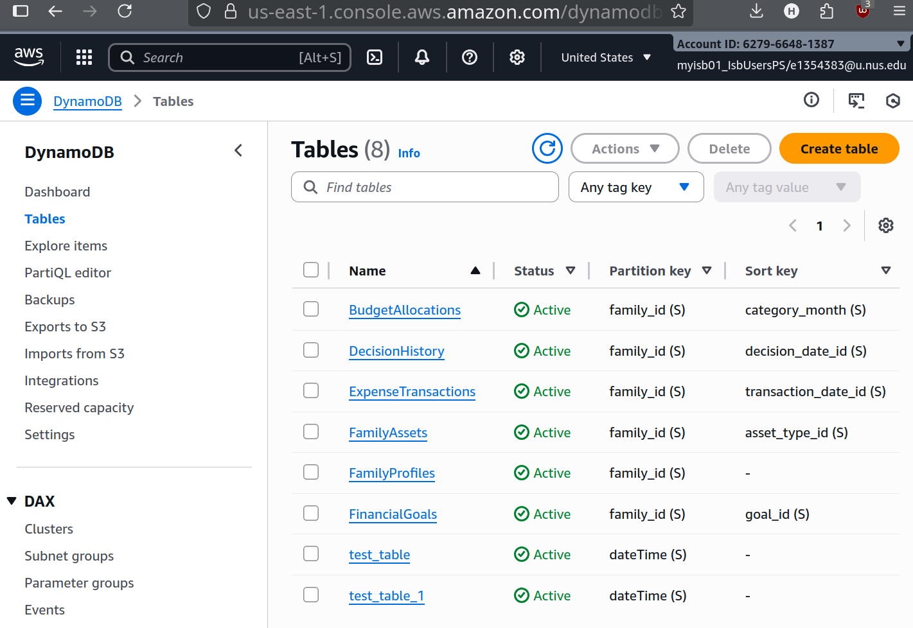

# To run ClariWealth
```
cd agent_sample
cd streamlit
source .venv/bin/activate
source .env
streamlit run streamlit.py
```
## Some sample accounts given
```
email: wongfam@gmail.com
password: wongfam
```
## Accounts can also be created


## To change stress levels of person, go to /agent_sample/streamlit/master_agent.py change line 35 'test_table_1'/'test_table_0' . test_table_1 is high stress, test_table_0 is normal, 
## To change stress levels of person, go to /agent_sample/streamlit/emotional_agent.py line 62 'test_table_1'/'test_table_0'. test_table_1 is high stress, test_table_0 is normal.

## System architecture
### Using AWS DynamoDB to store tables such as BudgetAllocations, ExpenseTransactions, FamilyAssets, FamilyProfiles, FinancialGoals, test_table, test_table_1. This normal/high stress levels is simulated data retrieved from a fitbit watch tracker.

### AWS Bedrock for Large Language Model querying to work as Agentic agents

### Streamlit is used as our front end for user's to use our ClariWealth service with a simple user interface.

### Strands sdk + Claude sonnet to manage prompt engineering the large language model.




### Purpose of each script
emotional_agent.py - agent that tracks user's emotion levels by heartrate and determines whether they are stressed or feeling relatively normal.

household_agent/finance_updated.py - main finance agent that does provide financial assistance

master_agent.py - orchestrator agent that is the main entry, and determines which agents are to be called

streamlit.py - the streamlit website server code that calls the master_agent to handle all tasks

.env - store key secrets as environment variables that are to be sourced before running the streamlit server.

### Unscucessful scripts

memory_agentsimple.py - unsuccessful attempt at integrating memory functionality into the finance agent

orchestration_agent.py - agent that is supposed to use memory + financial/household agent

myfinance_agent.py/old_finance_agent.py/master_agent_old.py - past backup files of current master_agent.py and finance_updated.py/household_agent.py
